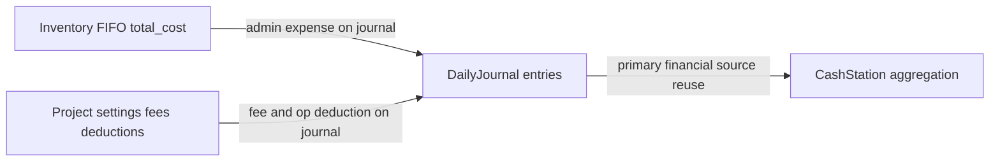

# Cash Station — Requirements Reference (No Implementation)

**Status:** Reference specification only. Do **not** implement the Cash Station module until explicitly requested.

**Sources of truth:** The written Cash Station specification is primary. The Excel sheet `محطة الصندوق` is supporting context only; where it differs from the written spec, that difference is recorded as an ambiguity — not resolved.

---

## Purpose of this module (from the written spec)

Cash Station is the **monthly aggregation and monitoring** layer over Daily Journal financial movements. It does **not** accept manual financial entries. It displays per-month summary cards and a per-project table, supports month carry-forward (without closing the month), and must eventually support inter-project surplus→deficit settlements that affect **Net Cash Fund only** (not Monthly Financial Result).

---

## Domain ownership / calculation boundary (confirmed)

Cash Station is **not** the owner of financial calculations.

| Responsibility | Owner |
|---|---|
| Day-level financial math (fees, deductions, admin expense/FIFO, `daily_total`, `fund_balance`, admin debt, etc.) | Other modules (primarily Daily Journal); values already **persisted** must be **reused**, never recalculated |
| Aggregating and presenting month-scoped indicators and the projects table | Cash Station |
| Month-level carry-forward records (when implemented) | Cash Station |
| Settlement records and their effects on Net Cash Fund (when implemented) | Cash Station |

Cash Station may perform **only** calculations that are unique to the Cash Station domain — for example monthly aggregation, carry-forward behavior, and settlement effects — and **only once those business rules are finalized**. Until then, those Cash Station–domain formulas remain among the documented ambiguities below; do not invent them.

This boundary strengthens the existing note that Cash Station must not recompute admin fee / FIFO / operational pool independently: it must not re-derive any value another module has already calculated and stored.

---

## Mapping to existing codebase

### Closest existing module pattern

[`Modules/AdministrationRates`](../Modules/AdministrationRates) is the nearest sibling: read-only reporting over `daily_journal_entries`, month/year filter, composite `summary` + table payload, `Controller → Action → Resource`, middleware `auth:sanctum` + `role:super-admin|finance`.

Cash Station is **not** yet present in the codebase (no module, routes, models, or enums).

### Primary financial data source

Daily Journal ([`Modules/DailyJournal`](../Modules/DailyJournal)) is the **primary** source of financial calculations. Cash Station must **reuse** all financial values already calculated and persisted by Daily Journal. It must never duplicate or rederive calculations already owned by other modules.

Future Cash Station–owned data (such as settlement records and carry-forward records) may become **additional persisted inputs** alongside Daily Journal — they do not replace Daily Journal as the primary financial source, and they must not reimplement upstream math.

Persisted journal fields and how they relate to the written Cash Station spec (mappings **not finalized**):

| Journal field | Spec concepts it may relate to (not finalized) |
|---|---|
| `daily_income` | Monthly Revenue |
| `daily_expense` | Monthly Expenses |
| `administrative_fee` | Total Administrative Percentage |
| `operational_deduction` | Total Operational Deduction |
| `administrative_expense` | Administrative expenses (mentioned in intro) |
| `contribution` | Daily contributions (mentioned in intro; distinct from Cash Station settlement contributions) |
| `daily_total` | Potential building block for Monthly Financial Result (**mapping not finalized**) |
| `fund_balance` | Existing day-to-day carried balance. Relationship to Cash Station monthly carry-forward remains **unresolved** (see ambiguity 8) |
| `administrative_debt` | Day’s admin debt |
| `accumulated_administrative_debt` | Running unpaid admin debt |

Authoritative day-level math: [`Modules/DailyJournal/EQUATIONS.md`](../Modules/DailyJournal/EQUATIONS.md). Cash Station reads these persisted fields; it does not recompute them.

### Existing stubs / hooks

- [`UpdateDailyJournalSummariesAction`](../Modules/DailyJournal/app/Actions/UpdateDailyJournalSummariesAction.php) — empty stub: “Summaries module not implemented yet.” Natural integration point if Daily Journal writes should refresh Cash Station-derived state later.
- [`UpdateDailyJournalReportsAction`](../Modules/DailyJournal) — similar reports stub (also unimplemented).

### Project vocabulary already in use

- [`ProjectStatus`](../Modules/Project/app/Enums/ProjectStatus.php): `active` / `stopped` / `archived` (lifecycle — **not** Cash Station financial Status).
- No `CashStationStatus` (or equivalent) enum exists.
- Daily Journal only allows **Active** projects in journal writes; Cash Station project set is unspecified in the written spec.

### Authorization precedent

Daily Journal and AdministrationRates both use `role:super-admin|finance`. No Cash Station permissions exist in the seeder yet.

### Excel artifact location (reference only)

[`scripts/reconciliation/_station_headers.json`](../scripts/reconciliation/_station_headers.json) and related `_contrib_*.json` probe the sheet **محطة الصندوق**. Useful for column naming cross-check; **not** an override of the written spec.

---

## Spec surface area (inventory — not an implementation checklist)

**Month selection:** all indicators/tables scoped to selected month; must refresh on month change.

**Summary cards (9):** Total Monthly Surplus, Total Monthly Deficit, Administrative Debts, Net Cash Funds, Monthly Revenue, Monthly Expenses, Total Administrative Percentage, Total Operational Deduction, Net Month (before settlements).

**Projects table columns:** Project, Previous Monthly Total, Monthly Total, Administrative Debt, Added Contribution, Deducted Contribution, Net Cash Fund, Remaining Debt, Status.

**Operations:** Month carry-forward (not a close; not read-only). Monthly settlement between projects (data model/calculations must support; settlement details may come later).

**Business rules 1–7:** month-scoped calc; previous total as next opening; surplus/deficit carry interaction; settlements affect Net Cash Fund only; unpaid admin debt carries until paid; edits to a carried month require recalculation of dependent later months (no stale carries).

---

## Dependencies (conceptual)

- **Primary financial source:** Daily Journal persisted calculated fields (read/reuse only; never rederive).
- **Additional CS inputs (later):** settlement records and carry-forward records owned by Cash Station, once implemented — still must not duplicate upstream module math.
- **Indirect:** Inventory and Project settings only via values already stored on journal rows (never re-derived in Cash Station).
- **Cash Station–owned (later, when rules finalized):** monthly aggregation of reused fields; carry-forward records; settlement records and Net Cash Fund effects.
- **Cross-cutting later:** If carry-forward / settlement persistence is added, Daily Journal write path may need to notify Cash Station to refresh aggregates (stub already exists). Relationship between Cash Station monthly carry-forward / “Previous Monthly Total” and Daily Journal’s continuous `fund_balance` is **unresolved** — see ambiguity 8.

---

## Documented ambiguities (do not resolve)

These are open until clarified. No formula, Status enum, or Excel-only rule is locked.

1. **Status values** — Spec requires a Status column (“current financial state”) but does not define allowed values. Excel has no Status column. **Do not define Status values.**

2. **Net Cash Fund formula vs Excel** — Spec: Previous + Monthly result + Added − Deducted. Excel (when added contribution is 0) subtracts **الدين المسدد** (debt paid) from monthly total as well. Spec does not mention debt-paid inside Net Cash. **Do not infer debt-repayment logic beyond the written spec.**

3. **Debt Paid / Contributing Project columns** — Present in Excel (`الدين المسدد`, `المشروع المساهم`); not listed in the written projects-table columns. Unknown whether the API/UI should include them.

4. **Daily columns 1–31** — Present in Excel; not in the written projects-table column list. Unknown whether the API returns per-day cells.

5. **What “Monthly Total” exactly sums** — Spec: “result of all financial movements recorded for the project during the selected month.” Does not state whether that is `SUM(daily_total)`, end-of-month `fund_balance` minus previous carry, or another expression. `daily_total` is only a **potential** building block; mapping is **not finalized**. Interaction with Rules 3–4 (carried surplus/deficit vs new surplus/deficit) is described narratively, not as equations.

6. **What carry-forward writes as next month’s Previous** — Spec: Monthly Total becomes next opening / Previous Monthly Total. Unclear how that interacts with Net Cash Fund after settlements (Rule 5: settlements do not change Monthly Result; carry text names Monthly Total, not Net Cash Fund).

7. **Administrative Debts card vs row Administrative Debt vs Remaining Debt** — Spec distinguishes summary “Administrative Debts” (outstanding until end of selected month), row “Administrative Debt”, and “Remaining Debt” (unpaid after settlement). Mapping to `administrative_debt` vs `accumulated_administrative_debt` (and any settlement adjustment) is not finalized.

8. **Cash Station carry vs Daily Journal `fund_balance`** — `fund_balance` is Daily Journal’s existing **day-to-day** carried balance. Spec introduces month-boundary Previous/Monthly/carry-forward with recalculation of subsequent months. Whether Cash Station owns persisted month snapshots, or is a pure live view over DJ, or both must stay in sync, is **unresolved**. Do not assume `fund_balance` is the Cash Station monthly carry-forward.

9. **Which projects appear** — All projects, only active, only those with journal activity in the month, include archived/stopped — unspecified.

10. **Settlement algorithm** — Spec allows later implementation; only requires contributor/receiver semantics and Added/Deducted contribution fields affecting Net Cash Fund only. No allocation priority, caps, or UI flow locked.

11. **“Net Month” vs “Net Cash Funds”** — Spec: Net Month = net result of all projects **before** settlements; Net Cash Funds = total cash balances **after** monthly calculation and settlements. Exact aggregation (sum of which row fields) is not formulaically stated.

12. **Recalculation trigger (Rule 7)** — Spec requires subsequent months to update when a carried month is modified. Does not specify trigger (on every DJ write, on carry-forward only, on explicit recalculate, etc.).

---

## Implementation considerations (notes only — not decisions)

When implementation of the Cash Station **module** is later requested, expect to revisit:

- New `nwidart` module vs extending AdministrationRates (Cash Station has write concerns — carry-forward, settlements — so it is heavier than pure AdministrationRates).
- Persistence for Previous Monthly Total / settlements / carry metadata if Rule 7 cannot be satisfied by live DJ aggregation alone.
- Wiring [`UpdateDailyJournalSummariesAction`](../Modules/DailyJournal/app/Actions/UpdateDailyJournalSummariesAction.php) once recalculation rules are clarified.
- Tests under root `tests/Feature/CashStation/` per project convention; roles aligned with finance modules unless specified otherwise.
- Localization via `__('messages....')` like existing modules.
- Do **not** invent formulas for ambiguous fields; clarify with product first.
- Never reimplement Daily Journal (or Inventory/Project) calculation logic inside Cash Station; only reuse persisted values and apply finalized Cash Station–domain rules. Future CS-owned settlement/carry-forward records are additional inputs — not a license to rederive upstream math.

---

## Explicit non-actions (until the Cash Station module is requested)

- No module scaffolding, migrations, endpoints, Actions, enums, or tests.
- No formula finalization, Status enum definition, or Excel-override of the written spec.
- No choosing among ambiguities above.
- No recalculation of values already owned and persisted by Daily Journal or other modules.
